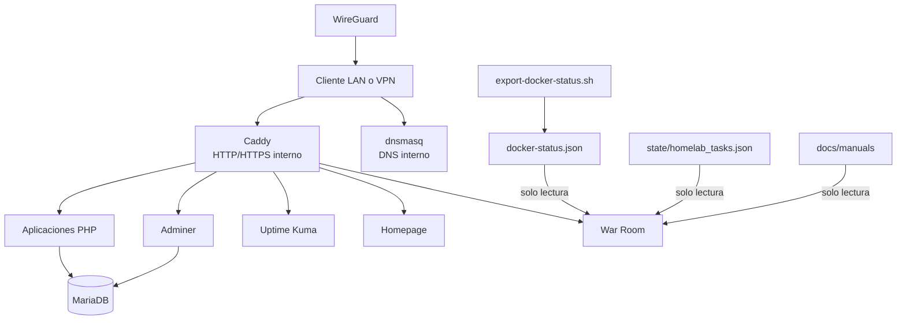

# Arquitectura de HomeLab

## 1. Alcance de este documento

Este documento describe lo observable en el código, la configuración local y
el snapshot público preparado a 14 de julio de 2026. Distingue entre arquitectura
operativa local y contenido reproducible desde Git. No presupone que un servicio
esté activo por el hecho de tener un Compose o un contenedor detenido.

## 2. Vista del sistema

HomeLab es un conjunto de despliegues Docker Compose independientes conectados
por una red proxy externa. No existe un Compose raíz que orqueste el sistema
completo.



La configuración real de Caddy, dnsmasq, WireGuard, el stack MVP y las
aplicaciones está presente solo en el entorno local e ignorada por Git. Por
tanto, esta vista describe el laboratorio inspeccionado, pero una clonación del
repositorio actual solo reproduce War Room y las herramientas versionadas.

## 3. Componentes demostrados

### 3.1 War Room

Aplicación server-rendered y sin framework, servida por PHP/Apache:

- `public/index.php` genera la estructura inicial y estados de respaldo.
- `public/assets/app.js` consulta periódicamente los endpoints y actualiza la UI.
- `public/assets/style.css` implementa la presentación responsive.
- `public/api/v1/` expone JSON de solo lectura.

Endpoints implementados:

| Endpoint | Fuente | Comportamiento real |
| --- | --- | --- |
| `health.php` | Proceso PHP | Salud básica y hora del servidor |
| `status.php` | Sondas de servicios | Resumen agregado; depende de PHP cURL |
| `services.php` | Definiciones internas y HTTP | Estado y latencia; depende de PHP cURL |
| `resources.php` | `/proc` y filesystem del contenedor | CPU estimada, memoria y disco visibles desde el contenedor, no necesariamente del host |
| `containers.php` | `/var/warroom-runtime/docker-status.json` | Inventario filtrado y detección de datos stale a los 45 segundos |
| `tasks.php` | Mount de estado o copia del repositorio | Valida esquema, estados y prioridades antes de responder |
| `manuals.php` | `docs/manuals` montado | Allowlist fija y lectura Markdown sin traversal |
| `operations.php` | Datos estáticos revisados | Diagnóstico informativo; no ejecuta operaciones |

Todos aplican cabeceras sin caché. El rate limit guarda contadores por IP y
endpoint en el directorio temporal del contenedor; es una protección básica por
instancia, no un control distribuido ni autenticación.

### 3.2 Exportador Docker

`tools/war-room/export-docker-status.sh` se ejecuta en el host, consulta Docker y
genera el fichero runtime mediante escritura temporal y `mv`. War Room recibe
solo JSON, nunca el socket de Docker. El exportador requiere Bash, Docker y
`jq`; su planificación periódica no está versionada ni demostrada.

El JSON incluye identificador corto, nombre, imagen, estado, texto de estado y
puertos de todos los contenedores. Aunque no contiene secretos por diseño, puede
revelar topología y no debe publicarse sin filtrado adicional.

### 3.3 Operación local y plantillas públicas

- `backup-mariadb.sh`: dump mediante `mariadb-dump`, secreto leído desde fichero
  local y salida con permisos restrictivos.
- `backup-uptime-kuma.sh`: parada confirmada, archivo temporal del volumen,
  validación y recuperación básica mediante `trap`; `DRY_RUN=1` por defecto.
- `update-stack.sh`: allowlist de stacks, confirmación de backup y doble
  confirmación antes de `pull` y `up -d`; solo se ha demostrado en dry-run.
- `status-homelab.sh`: diagnóstico directo del daemon y del espacio Docker.
- `scripts/examples/`: plantillas parametrizadas incluidas en el snapshot
  público.

Los cuatro scripts operativos están ligados al host y permanecen fuera del
snapshot público. También se conservan de forma privada las evidencias de
ejecución y restauración. Las plantillas públicas demuestran el enfoque sin
publicar rutas, nombres de stacks ni estado del entorno real.

### 3.4 Stacks locales no versionados

Se inspeccionaron los siguientes Compose válidos sintácticamente:

| Stack | Imágenes declaradas | Estado de publicación |
| --- | --- | --- |
| MVP | `mariadb:11`, `adminer:latest`, `louislam/uptime-kuma:1`, `php:8.3-apache`, `ghcr.io/gethomepage/homepage:latest` | Local, ignorado |
| Proxy | `caddy:2-alpine` | Local, ignorado |
| DNS | `jpillora/dnsmasq:latest` | Local, ignorado; contiene bind a IP privada |
| VPN | `lscr.io/linuxserver/wireguard:latest` | Local, ignorado; contiene claves y configuración real |
| War Room | `php:8.3-apache` | Ejemplo saneado rastreado; Compose real local no rastreado |

Las etiquetas `latest` reducen reproducibilidad. No hay hashes de imagen,
healthchecks uniformes, CI ni pruebas automáticas de integración.

## 4. Redes y resolución

- `homelab_proxy` es una red Docker externa compartida por proxy y servicios.
- MariaDB se publica solo en loopback en el Compose local inspeccionado.
- Los servicios web internos se conectan al proxy por nombre de contenedor.
- dnsmasq sirve nombres bajo el dominio reservado `.home.arpa` en una IP LAN.
- Caddy termina HTTPS interno con una CA local.
- WireGuard proporciona acceso remoto privado según la documentación y la
  configuración local, pero su robustez actual no ha sido revalidada.

Los nombres `.home.arpa` no son dominios públicos. Aun así, los subdominios,
nombres de contenedor, puertos e IP LAN forman parte de la topología privada y
deben parametrizarse en los ejemplos públicos.

## 5. Datos y límites de confianza

```text
Zona versionada y revisable
  War Room, scripts saneados, plantillas, manuales, checklist

Zona local de configuración
  Compose reales, Caddyfile, dnsmasq, .env, configuración WireGuard

Zona sensible
  secretos, claves, CA, dumps, backups, bases de datos, uploads

Zona generada
  logs, runtime JSON, temporales y estado de contenedores
```

Controles existentes:

- `.gitignore` de exclusión conservadora.
- Mounts read-only en el Compose de ejemplo de War Room.
- Ausencia deliberada de `docker.sock` en el contenedor web.
- Allowlist de manuales y filtrado de campos de tareas/contenedores.
- Secretos de scripts leídos desde ficheros ignorados.
- Backups creados con `umask 077` y comprobaciones de salida.

Limitaciones:

- No hay autenticación en War Room; la seguridad depende del perímetro local.
- El rate limit usa ficheros temporales y confía en `REMOTE_ADDR`.
- Las sondas desactivan la verificación TLS cuando consultan URLs HTTPS; esta
  decisión solo es aceptable dentro de una red privada controlada.
- La imagen de War Room compila y valida PHP cURL durante el build.
- Las sondas se ejecutan secuencialmente, sin caché. Con varios servicios caídos,
  `status.php` y `services.php` pueden acumular varios timeouts y responder con
  latencia elevada.
- Los datos iniciales de la UI contienen estados estáticos que pueden mostrarse
  antes de que responda la API y no son una fuente de verdad.
- No existe automatización versionada para ejecutar periódicamente el exportador.

## 6. Dependencias

Dependencias directas versionadas:

- PHP 8.3, Apache y APIs estándar de PHP.
- JavaScript y CSS nativos, sin gestor de paquetes frontend.
- Bash, Docker CLI, Docker Compose v2 y `jq` para herramientas.
- Red Docker externa creada fuera del Compose de War Room.

Dependencias locales observadas: Caddy, MariaDB, Adminer, Uptime Kuma, Homepage,
WireGuard y dnsmasq. No existe un fichero único que fije o compruebe todas sus
versiones.

## 7. Estructura pública de v0.1

```text
.
├── platform/
│   └── war-room/
│       ├── docker-compose.example.yml
│       ├── Dockerfile
│       ├── examples/docker-status.example.json
│       └── public/
├── scripts/examples/
├── tools/war-room/export-docker-status.sh
├── docs/manuals/
├── state/homelab_tasks.example.json
├── .env.example
├── README.md
├── ARCHITECTURE.md
├── ROADMAP.md
├── PRE_PUBLISH_CHECKLIST.md
├── PUBLIC_V0.1_MANIFEST.txt
├── SECURITY.md
└── LICENSE
```

`PUBLIC_V0.1_MANIFEST.txt` contiene la lista exacta de ficheros rastreados en la
rama pública canónica. El tag `v0.1.0` conserva su copia histórica del
manifiesto. Directorios no representados en esta vista permanecen fuera del
contenido público aunque existan en el árbol operativo.

## 8. Separación entre snapshot y entorno operativo

- El Compose real, el estado operativo y los scripts ligados al host se
  conservan localmente e ignorados.
- Los documentos históricos y evidencias de pruebas quedan fuera de v0.1; los
  procedimientos saneados viven en `docs/manuals/`.
- La configuración publicable usa `.env.example`, ficheros `*.example.*` y
  valores genéricos.
- Una exportación temporal construida exclusivamente con la allowlist puede
  usarse para validar el contenido; los commits y pushes se realizan desde el
  repositorio canónico después de revisar el índice.
