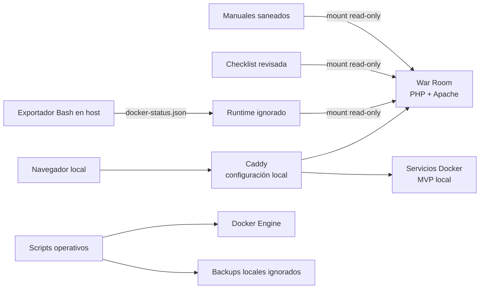

# HomeLab — War Room y operación local segura

Laboratorio doméstico basado en Docker Compose para practicar operación segura,
observabilidad local, copias de seguridad y recuperación. El componente propio
principal es **War Room**, un panel PHP/JavaScript de solo lectura que consume
estado revisado sin montar el socket de Docker ni ejecutar comandos del host.

> **Estado de publicación:** la versión `v0.1.0` está integrada en la
> rama canónica `main`. Las comprobaciones aplicables antes de cada publicación
> están en
> [PRE_PUBLISH_CHECKLIST.md](PRE_PUBLISH_CHECKLIST.md).

**Navegación:** [arquitectura](ARCHITECTURE.md) ·
[ejecutar War Room](platform/war-room/README.md#configuración-de-ejemplo) ·
[roadmap](ROADMAP.md) · [seguridad](SECURITY.md)

## Qué demuestra el proyecto

- Diseño de una plataforma local por capas: servicios, proxy, DNS, VPN y
  herramientas de operación.
- Panel web propio con frontend responsive y API JSON en PHP 8.
- Separación entre aplicación, estado revisado y datos runtime generados fuera
  del contenedor web.
- Automatización Bash defensiva con `set -euo pipefail`, `DRY_RUN`,
  confirmaciones explícitas y permisos restrictivos.
- Procedimientos de backup y pruebas de restauración aisladas para MariaDB y
  Uptime Kuma.
- Política Git conservadora para excluir claves, credenciales, certificados,
  dumps, volúmenes, logs y configuración específica del host.

## Estado real

| Área | Estado | Evidencia en el repositorio |
| --- | --- | --- |
| War Room read-only | Implementado | UI y API bajo `platform/war-room/public/` |
| Salud, servicios y recursos | Implementado | Endpoints PHP y extensión cURL integrada en la imagen de War Room |
| Estado de contenedores | Implementado | Exportador Bash y consumo de JSON runtime con control de caducidad |
| Manuales y checklist | Implementado | Lectura desde mounts read-only con allowlist y filtrado de campos |
| Backups MariaDB/Uptime Kuma | Implementado en local | El snapshot incluye plantillas saneadas; scripts, pruebas y backups operativos permanecen privados |
| Actualización de stack | Implementado en local | El snapshot incluye una plantilla con dry-run; el script ligado al host permanece privado |
| Caddy, dnsmasq, WireGuard y stack MVP | Implementado en local | Configuración local ignorada; no forman parte del snapshot reproducible |

El estado de los contenedores del laboratorio cambia con el entorno y no forma
parte del snapshot público. La tabla distingue expresamente entre lo demostrable
desde una clonación y lo implementado únicamente en la instalación privada.

No hay una instancia pública de War Room. El Compose de ejemplo publica el panel
solo en `127.0.0.1` por defecto; exponerlo fuera del equipo local requiere una
decisión de seguridad independiente.

<details>
<summary>Ver referencia visual conceptual</summary>


Esta imagen es una referencia de diseño, no una captura del panel implementado.
Las cifras, servicios y eventos que muestra no representan telemetría real.

</details>

## Arquitectura resumida



War Room no accede a `docker.sock`. El host exporta un subconjunto del estado de
Docker a JSON y el contenedor web lo consume en modo lectura. Consulta el diseño,
los límites de confianza y la topología completa en
[ARCHITECTURE.md](ARCHITECTURE.md).

## Contenido versionado

```text
.
├── platform/war-room/       # Aplicación propia y Compose saneado de ejemplo
├── scripts/examples/        # Plantillas operativas reutilizables
├── tools/war-room/          # Exportador de estado Docker
├── state/                   # Ejemplo saneado de tareas para War Room
├── docs/manuals/            # Manuales operativos saneados
├── ARCHITECTURE.md
├── ROADMAP.md
├── PRE_PUBLISH_CHECKLIST.md
├── PUBLIC_V0.1_MANIFEST.txt
├── SECURITY.md
└── LICENSE
```

La máquina de desarrollo contiene además `apps/`, `stacks/`, `proxy/`,
`platform/wireguard/`, `backups/`, `certs/` y `runtime/`. Esas rutas se excluyen
de Git porque mezclan configuración real, datos persistentes o material
sensible. No forman parte de una clonación pública reproducible.

## Requisitos comprobables

- Docker Engine con Docker Compose v2 para los despliegues.
- PHP 8.3, Apache y extensión cURL integrados en la imagen de War Room.
- Bash, `jq` y acceso local autorizado a Docker para el exportador.
- Una red Docker externa para conectar War Room con el proxy y otros servicios.

## Validación local segura

Validación estática del snapshot:

```bash
docker compose -f platform/war-room/docker-compose.example.yml config --quiet
find platform/war-room/public -type f -name '*.php' -print0 | xargs -0 -n1 php -l
find scripts tools -type f -name '*.sh' -print0 | xargs -0 -n1 bash -n
jq empty state/homelab_tasks.example.json platform/war-room/examples/docker-status.example.json
```

La prueba de construcción y arranque está documentada en
[`platform/war-room/README.md`](platform/war-room/README.md). El Compose es una
plantilla saneada, no un despliegue completo listo para producción.

## Seguridad y publicación

El repositorio adopta exclusión por defecto. Nunca deben publicarse:

- `.env`, passwords, tokens, hashes de autenticación o ficheros de secretos;
- claves privadas o precompartidas de WireGuard;
- certificados y CA locales asociados a la infraestructura real;
- Caddyfiles, Compose o DNS con rutas, IP y topología privadas;
- dumps SQL, bases de datos, backups, logs o estado runtime;
- paquetes de recuperación, ya que pueden incluir el árbol local completo.

El entorno privado contiene material operativo que permanece ignorado y fuera
del contenido público. Este repositorio conserva la historia real del proyecto;
cada commit destinado a `origin/main` debe respetar la allowlist y las
exclusiones de seguridad. Las comprobaciones ejecutables están en
[PRE_PUBLISH_CHECKLIST.md](PRE_PUBLISH_CHECKLIST.md).

Para comunicar una vulnerabilidad, consulta la
[política de seguridad](SECURITY.md) y evita publicar secretos o detalles
privados en un issue.

## Licencia

HomeLab se publica bajo la [MIT License](LICENSE) (`MIT`).

## Alcance

Este repositorio es una muestra técnica, no una distribución de infraestructura
lista para desplegar. No incluye secretos, datos persistentes ni todos los
Compose reales necesarios para reconstruir el HomeLab completo.

El estado actual y las siguientes versiones están separados en
[ROADMAP.md](ROADMAP.md). No se atribuye a la versión actual ninguna capacidad
que solo figure como idea o tarea futura.

La allowlist exacta del primer snapshot público está en
[PUBLIC_V0.1_MANIFEST.txt](PUBLIC_V0.1_MANIFEST.txt).
