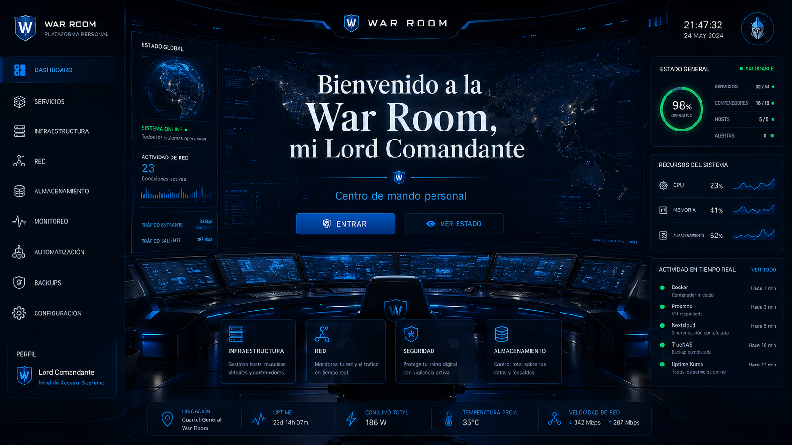
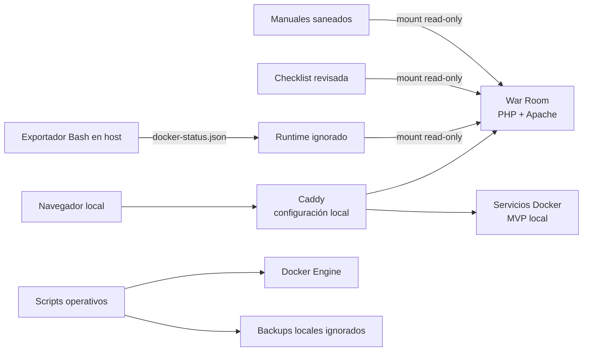

# HomeLab

Laboratorio doméstico basado en Docker Compose para practicar operación segura,
observabilidad local, copias de seguridad y recuperación. El componente propio
principal es **War Room**, un panel PHP/JavaScript de solo lectura que consume
estado revisado sin montar el socket de Docker ni ejecutar comandos del host.

> **Estado de publicación:** `v0.1` preparada y validada para publicación.
> Licencia MIT, PHP cURL, snapshot, manifest, historial Git y Gitleaks han sido
> verificados. Solo queda crear el repositorio público, añadir el remoto y hacer
> push.



_Referencia visual conceptual. Las cifras, servicios y eventos de esta imagen
no representan telemetría implementada._

## Qué demuestra el proyecto

- Diseño de una plataforma local por capas: servicios, proxy, DNS, VPN y
  herramientas de operación.
- Panel web propio con frontend responsive y API JSON en PHP 8.
- Separación entre aplicación, estado revisado y datos runtime generados fuera
  del contenedor web.
- Automatización Bash defensiva con `set -euo pipefail`, `DRY_RUN`,
  confirmaciones explícitas y permisos restrictivos.
- Procedimientos de backup y pruebas de restauración aisladas para MariaDB y
  Uptime Kuma.
- Política Git conservadora para excluir claves, credenciales, certificados,
  dumps, volúmenes, logs y configuración específica del host.

## Estado real

| Área | Estado | Evidencia en el repositorio |
| --- | --- | --- |
| War Room read-only | Implemented | UI y API bajo `platform/war-room/public/` |
| Salud, servicios y recursos | Implemented | Endpoints PHP y extensión cURL integrada en la imagen de War Room |
| Estado de contenedores | Implemented | Exportador Bash y consumo de JSON runtime con control de caducidad |
| Manuales y checklist | Implemented | Lectura desde mounts read-only con allowlist y filtrado de campos |
| Backups MariaDB/Uptime Kuma | Implemented locally | Scripts rastreados y pruebas de restauración registradas; los backups reales no se versionan |
| Actualización de stack | Implemented, dry-run validated | Script con allowlist y confirmaciones; ejecución real no demostrada |
| Caddy, dnsmasq, WireGuard y stack MVP | Implemented locally | Configuración local ignorada y contenedores existentes, actualmente detenidos |
| Operaciones desde War Room | Planned | La API actual es deliberadamente de solo lectura |
| Orquestador, IA interna y exposición pública | Future Work | No existe implementación demostrable |

La última inspección local se realizó el **12 de julio de 2026**. No había
contenedores HomeLab en ejecución; se encontraron despliegues previos detenidos
de Caddy, dnsmasq, WireGuard, MariaDB, Adminer, Uptime Kuma, Homepage y
aplicaciones PHP. War Room no figuraba como contenedor existente en ese momento.

## Arquitectura resumida



War Room no accede a `docker.sock`. El host exporta un subconjunto del estado de
Docker a JSON y el contenedor web lo consume en modo lectura. Consulta el diseño,
los límites de confianza y la topología completa en
[ARCHITECTURE.md](ARCHITECTURE.md).

## Contenido versionado

```text
.
├── platform/war-room/       # Aplicación propia y Compose saneado de ejemplo
├── scripts/                 # Operación local y plantillas reutilizables
├── tools/war-room/          # Exportador de estado Docker
├── state/                   # Checklist revisada consumida por War Room
├── docs/manuals/            # Manuales operativos saneados
├── docs/                    # Registro técnico y pruebas realizadas
├── ARCHITECTURE.md
├── ROADMAP.md
└── PRE_PUBLISH_CHECKLIST.md
```

La máquina de desarrollo contiene además `apps/`, `stacks/`, `proxy/`,
`platform/wireguard/`, `backups/`, `certs/` y `runtime/`. Esas rutas se excluyen
de Git porque mezclan configuración real, datos persistentes o material
sensible. No forman parte de una clonación pública reproducible.

## Requisitos comprobables

- Docker Engine con Docker Compose v2 para los despliegues.
- PHP 8.3, Apache y extensión cURL integrados en la imagen de War Room.
- Bash, `jq` y acceso local autorizado a Docker para el exportador.
- Una red Docker externa para conectar War Room con el proxy y otros servicios.

## Validación local segura

Estas comprobaciones no arrancan servicios ni modifican datos:

```bash
docker compose -f platform/war-room/docker-compose.example.yml config --quiet
docker compose -f platform/war-room/docker-compose.example.yml build
docker compose -f platform/war-room/docker-compose.example.yml run --rm war-room php -r 'var_export(extension_loaded("curl"));'
find platform/war-room/public -type f -name '*.php' -print0 | xargs -0 -n1 php -l
find scripts tools -type f -name '*.sh' -print0 | xargs -0 -n1 bash -n
jq empty state/homelab_tasks.json
DRY_RUN=1 STACK_DIR=/ruta/al/stack STACK_NAME=fase-1-mvp scripts/update-stack.sh
```

El Compose es una plantilla saneada, no un despliegue completo listo para
producción. Requiere crear la red externa y aportar rutas locales.

## Seguridad y publicación

El repositorio adopta exclusión por defecto. Nunca deben publicarse:

- `.env`, passwords, tokens, hashes de autenticación o ficheros de secretos;
- claves privadas o precompartidas de WireGuard;
- certificados y CA locales asociados a la infraestructura real;
- Caddyfiles, Compose o DNS con rutas, IP y topología privadas;
- dumps SQL, bases de datos, backups, logs o estado runtime;
- paquetes de recuperación, ya que pueden incluir el árbol local completo.

La versión `v0.1` se construyó desde un snapshot curado con 41 archivos, validado
contra `PUBLIC_V0.1_MANIFEST.txt`. El repositorio tiene un único commit raíz y
su árbol e historial se auditaron con Gitleaks sin hallazgos. Ver
[PRE_PUBLISH_CHECKLIST.md](PRE_PUBLISH_CHECKLIST.md).

## Licencia

HomeLab se publica bajo la [MIT License](LICENSE) (`MIT`).

## Alcance

Este repositorio es una muestra técnica, no una distribución de infraestructura
lista para desplegar. No incluye secretos, datos persistentes ni todos los
Compose reales necesarios para reconstruir el HomeLab completo.

El estado actual y las siguientes versiones están separados en
[ROADMAP.md](ROADMAP.md). No se atribuye a la versión actual ninguna capacidad
que solo figure como idea o tarea futura.

La allowlist exacta utilizada para construir el snapshot público está en
[PUBLIC_V0.1_MANIFEST.txt](PUBLIC_V0.1_MANIFEST.txt).
