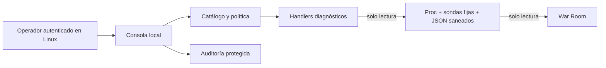

# Diseño de la consola de operaciones catalogadas

## 1. Propósito

Este documento define el contrato de diseño para un futuro MVP diagnóstico de
la consola de operaciones catalogadas de HomeLab. Su finalidad es permitir que
un operador autenticado solicite comprobaciones locales, predefinidas y
auditables sin disponer de una shell ni ampliar los privilegios de War Room.

Este documento no implementa la consola. Cualquier código futuro debe respetar
íntegramente estos límites antes de considerarse apto para pruebas operativas.

## 2. Alcance del MVP

El MVP será una herramienta CLI local, sin servidor web ni API remota. Se usará
desde una sesión Linux ya autenticada, abierta localmente o mediante los canales
privados existentes, como SSH o VPN.

Características del MVP:

- Solo operaciones diagnósticas.
- Catálogo cerrado de cinco `operation_id`.
- Denegación por defecto.
- Handlers fijos, implementados como funciones o componentes explícitos.
- Parámetros con esquema cerrado y validación positiva.
- Salida JSON estructurada, acotada y saneada.
- Timeout y límite de salida por operación.
- Autorización basada en identidad y grupos del sistema operativo.
- Registro de solicitudes, denegaciones y resultados.

No habrá ejecución en segundo plano, colas, programación periódica ni ejecución
paralela en la primera versión.

## 3. No objetivos

El MVP no pretende ser:

- Una terminal interactiva, PTY, shell remota o editor de comandos.
- Una interfaz web o una extensión ejecutora de War Room.
- Un orquestador de contenedores, servicios o despliegues.
- Un sistema de backup, restauración o actualización.
- Un gestor de secretos, usuarios, certificados o configuración.
- Un chatbot, copiloto, asistente de voz o componente de IA.
- Un sustituto de SSH, VPN, systemd, Docker Compose o las herramientas del host.
- Un mecanismo para ejecutar scripts operativos existentes.

Las operaciones que modifiquen estado quedan expresamente fuera del MVP.

## 4. Principios de seguridad

### 4.1 Denegación por defecto

Una operación, objetivo o parámetro que no figure expresamente en el catálogo
debe rechazarse. La ausencia de una regla nunca implica autorización.

### 4.2 Mínimo privilegio

La consola se ejecutará como un usuario sin privilegios administrativos. No
usará `root`, `sudo`, el grupo `docker`, `docker.sock` ni credenciales de
servicios. Solo podrá leer las fuentes saneadas requeridas por el catálogo.

### 4.3 Sin shell ni comandos construidos

Los handlers no construirán cadenas de comandos ni invocarán `/bin/sh`,
`bash -c`, `eval`, `system()` o equivalentes. Se preferirán APIs del lenguaje,
lectura directa de fuentes permitidas y clientes HTTP con configuración fija.

Si en una fase posterior fuese imprescindible ejecutar un binario, deberá
aprobarse de forma específica, usar una ruta absoluta y recibir los argumentos
como elementos separados y predefinidos. Esa excepción no forma parte del MVP.

### 4.4 Parámetros cerrados

Los parámetros solo pueden ser enums, booleanos o valores numéricos con rango
explícito. No se admitirán rutas, URLs, hostnames, puertos, expresiones, flags,
fragmentos de shell ni texto libre proporcionado por el operador.

### 4.5 Salida mínima

Cada handler devolverá únicamente los campos definidos en su esquema. No se
devolverán stdout, stderr, trazas, variables de entorno, cabeceras HTTP, cuerpos
de respuesta ni contenido completo de ficheros.

### 4.6 Fallo cerrado

Un error de configuración, autorización, validación, timeout o lectura debe
terminar la operación sin intentar rutas alternativas más permisivas.

## 5. Encaje en la arquitectura



La consola vive fuera del contenedor y del código de War Room. War Room:

- No conoce un endpoint de ejecución.
- No invoca la CLI ni sus handlers.
- No posee credenciales, tokens o permisos de la consola.
- No monta sockets, binarios o directorios de control de la consola.
- Solo podría consumir en el futuro un resumen JSON saneado generado de forma
  externa, igual que consume otros datos runtime de solo lectura.

No existe ninguna flecha de War Room hacia la consola en el límite de confianza.

## 6. Contrato obligatorio por operación

Toda entrada del catálogo debe declarar:

| Campo | Requisito |
| --- | --- |
| `operation_id` | Identificador estable y único |
| `version` | Versión del contrato de la operación |
| `classification` | `diagnostic`; cualquier otro valor se rechaza en el MVP |
| `handler` | Referencia interna fija, nunca texto ejecutable |
| `allowed_targets` | Conjunto cerrado de identificadores lógicos |
| `parameter_schema` | Campos, tipos, enums, rangos y obligatoriedad |
| `required_role` | Rol mínimo autorizado |
| `timeout_seconds` | Límite estricto de ejecución |
| `maximum_output_bytes` | Tamaño máximo del resultado serializado |
| `concurrency_key` | Clave para impedir ejecuciones solapadas |
| `confirmation_required` | Siempre `false` en el MVP diagnóstico |
| `output_schema` | Campos exactos permitidos en `data` |
| `redaction_policy` | Campos que deben omitirse o sanearse |

El catálogo debe estar versionado y ser revisable. No podrá ampliarse mediante
configuración local no validada ni descubrimiento automático de ejecutables,
servicios o ficheros.

## 7. Esquema común de solicitud y resultado

La CLI transformará los argumentos validados en una solicitud interna. Este
objeto es un contrato conceptual, no una API de red:

```json
{
  "schema_version": "1",
  "request_id": "generado-por-la-consola",
  "operation_id": "service.probe",
  "parameters": {
    "service_id": "war-room"
  }
}
```

El resultado seguirá este sobre común:

```json
{
  "schema_version": "1",
  "request_id": "generado-por-la-consola",
  "operation_id": "service.probe",
  "status": "ok",
  "started_at": "fecha-UTC-en-formato-ISO-8601",
  "duration_ms": 25,
  "data": {},
  "warnings": [],
  "error": null
}
```

Valores permitidos para `status`:

- `ok`: operación completada y datos válidos.
- `partial`: resultado válido pero incompleto o stale.
- `error`: fallo controlado durante la comprobación.
- `denied`: autorización, operación, objetivo o parámetros rechazados.

Errores comunes:

- `operation_not_allowed`
- `authorization_denied`
- `parameter_invalid`
- `target_not_allowed`
- `source_unavailable`
- `source_stale`
- `timeout`
- `output_limit_exceeded`
- `internal_error`

Los errores no incluirán rutas, excepciones, comandos, trazas ni datos de la
fuente original.

## 8. Catálogo MVP

### 8.1 `catalog.list`

- **`operation_id`:** `catalog.list`.
- **Tipo:** diagnóstica, metadatos.
- **Objetivo:** mostrar las operaciones autorizadas para el operador actual.
- **Parámetros permitidos:** ninguno; `parameters` debe ser un objeto vacío.
- **Validaciones:** identidad resuelta, rol autorizado y catálogo válido.
- **Salida esperada:** `operation_id`, versión, descripción breve, parámetros
  públicos y límites de cada operación permitida.
- **Errores esperados:** `authorization_denied`, `parameter_invalid` e
  `internal_error`.
- **Límites:** timeout de 1 segundo y salida máxima de 64 KiB.
- **Restricciones:** no muestra referencias de handlers, rutas, permisos del
  host, fuentes privadas ni operaciones no autorizadas.

### 8.2 `system.summary`

- **`operation_id`:** `system.summary`.
- **Tipo:** diagnóstica, lectura local.
- **Objetivo:** resumir uptime, memoria y sistema de archivos raíz visibles para
  el proceso sin enumerar procesos, mounts o dispositivos.
- **Parámetros permitidos:** ninguno.
- **Validaciones:** fuentes permitidas legibles; valores numéricos no negativos
  y coherentes; timestamp UTC válido.
- **Salida esperada:** `checked_at`, `uptime_seconds`, memoria total/disponible y
  filesystem raíz total/disponible, expresados en bytes.
- **Errores esperados:** `source_unavailable`, `parameter_invalid`, `timeout` e
  `internal_error`.
- **Límites:** timeout de 2 segundos y salida máxima de 32 KiB.
- **Restricciones:** no devuelve hostname, usuarios, procesos, argumentos,
  interfaces, IP, lista de mounts ni nombres de dispositivos.

### 8.3 `service.probe`

- **`operation_id`:** `service.probe`.
- **Tipo:** diagnóstica, sonda de red fija.
- **Objetivo:** comprobar disponibilidad y latencia de un servicio previamente
  declarado en el catálogo privado de objetivos.
- **Parámetros permitidos:** `service_id`, enum obligatorio de identificadores
  públicos conocidos; inicialmente solo `war-room`.
- **Validaciones:** coincidencia exacta con la allowlist; método, URL, puerto,
  timeout y política TLS definidos del lado de la consola.
- **Salida esperada:** `service_id`, `state`, `latency_ms`, categoría de código
  HTTP y `checked_at`.
- **Errores esperados:** `target_not_allowed`, `parameter_invalid`, `timeout`,
  `source_unavailable` e `internal_error`.
- **Límites:** una sonda por solicitud, timeout total de 3 segundos y salida
  máxima de 16 KiB.
- **Restricciones:** el operador no introduce URL, hostname, IP, puerto, método,
  cabeceras o cuerpo. No se siguen redirecciones a otro host ni se devuelven
  URL final, IP resuelta, cabeceras, cuerpo ni detalles del certificado.

### 8.4 `runtime.validate`

- **`operation_id`:** `runtime.validate`.
- **Tipo:** diagnóstica, validación de datos.
- **Objetivo:** comprobar esquema, tamaño y frescura de una fuente JSON saneada.
- **Parámetros permitidos:** `source_id`, enum obligatorio `containers` o
  `tasks`.
- **Validaciones:** el ID se resuelve internamente a una ruta fija; fichero
  regular, legible, sin symlinks fuera del directorio permitido, tamaño máximo,
  JSON válido, esquema conocido y timestamp aceptable.
- **Salida esperada:** `source_id`, `valid`, `freshness`, `checked_at`, número de
  elementos y lista acotada de códigos de validación.
- **Errores esperados:** `target_not_allowed`, `parameter_invalid`,
  `source_unavailable`, `source_stale`, `output_limit_exceeded` e
  `internal_error`.
- **Límites:** fichero máximo de 1 MiB, timeout de 2 segundos, hasta 20 códigos
  de validación y salida máxima de 32 KiB.
- **Restricciones:** no acepta rutas ni devuelve contenido, nombres privados,
  descripciones de tareas o campos descartados por el esquema.

### 8.5 `runtime.summary`

- **`operation_id`:** `runtime.summary`.
- **Tipo:** diagnóstica, resumen de datos.
- **Objetivo:** producir un agregado mínimo de una fuente JSON saneada después
  de validarla en la misma ejecución.
- **Parámetros permitidos:** `source_id`, enum obligatorio `containers` o
  `tasks`.
- **Validaciones:** las mismas que `runtime.validate`; si la fuente no es válida
  no se genera resumen.
- **Salida esperada:** `source_id`, `freshness`, `checked_at` y conteos agregados
  por estado permitido.
- **Errores esperados:** `target_not_allowed`, `parameter_invalid`,
  `source_unavailable`, `source_stale`, `timeout` e `internal_error`.
- **Límites:** fichero máximo de 1 MiB, timeout de 2 segundos y salida máxima de
  32 KiB.
- **Restricciones:** no devuelve nombres de contenedores, imágenes, puertos,
  títulos de tareas, notas, rutas ni el documento JSON original.

## 9. Operaciones prohibidas

La consola no admitirá:

- PTY, shell libre, texto ejecutable o selección de binarios.
- Rutas, URLs, hostnames, IP, puertos, flags o argumentos arbitrarios.
- `root`, `sudo`, cambio de usuario o pertenencia al grupo `docker`.
- Acceso a `docker.sock`, Docker CLI, `docker exec` o Docker Compose.
- Inicio, parada o reinicio de servicios y contenedores.
- Despliegues, actualizaciones, instalación de paquetes o cambios de versión.
- Escritura, edición, movimiento o borrado arbitrario de ficheros.
- Restauración o eliminación de backups.
- Lectura libre de logs, variables de entorno o ficheros de configuración.
- Gestión de usuarios, procesos, firewall, DNS, VPN, proxy o certificados.
- Operaciones Git que modifiquen estado o contacten con remotos.
- Reboot, shutdown, señales a procesos, mounts o cambios del kernel.
- Ejecución programada, encadenada, paralela o disparada por eventos.

Añadir cualquiera de estas capacidades exige un diseño nuevo y no constituye
una evolución implícita de este MVP.

## 10. Autenticación y autorización

### 10.1 Autenticación

La consola delegará la autenticación en la sesión Linux existente. No gestionará
passwords, tokens, cookies, claves SSH ni factores de autenticación propios.

El acceso remoto, si existe, termina antes de la consola mediante SSH o VPN. La
consola no abre puertos ni escucha en interfaces de red.

### 10.2 Autorización

- Rol inicial único: `diagnostic_operator`.
- Asociación del rol mediante un grupo Unix dedicado, distinto de `sudo` y
  `docker`.
- Comprobación de identidad, grupos y permiso para cada solicitud.
- Denegación si la identidad no puede resolverse o el catálogo no está íntegro.
- El cliente no puede declarar su rol ni modificar la decisión.
- La autorización se aplica antes de validar o leer el objetivo.

### 10.3 Confirmación

Las operaciones del MVP no modifican estado y no requieren confirmación
interactiva. La consola mostrará operación y objetivo antes de ejecutar, pero no
existirá `--force`, `--yes` ni una confirmación reutilizable.

Las confirmaciones para acciones con impacto quedan fuera de este documento.
Una fase futura deberá definir autorización ligada a operación y objetivo,
caducidad, protección frente a replay y una vista previa inequívoca.

## 11. Auditoría

Cada intento, incluido uno denegado, registrará como mínimo:

- Timestamp UTC.
- Identidad y grupos efectivos del operador, normalizados.
- `request_id`, `operation_id` y versión.
- Objetivo lógico y parámetros ya validados.
- Decisión de autorización y motivo normalizado.
- Inicio, duración, estado final y código de error.
- Versión del catálogo y del binario futuro.

No se registrarán:

- Passwords, tokens, cookies, claves o variables de entorno.
- Rutas privadas, URLs completas o configuración de objetivos.
- Cuerpos HTTP, stdout, stderr, trazas o contenido original de JSON.
- Datos que un handler haya descartado mediante su política de redacción.

Los campos de log deben sanear retornos de carro, saltos de línea y delimitadores
para evitar log injection. El destino recomendado es journald o un mecanismo
equivalente cuya modificación no esté permitida al usuario ejecutor. Deben
existir rotación, límite de tamaño y una política de retención explícita.

## 12. Modelo de amenazas resumido

| Amenaza | Escenario | Control principal |
| --- | --- | --- |
| Inyección | Parámetro intenta alterar el handler o sus argumentos | Sin shell, schemas cerrados y allowlist positiva |
| Escalada de privilegios | La consola hereda permisos administrativos | Usuario sin privilegios, sin `sudo` ni grupo `docker` |
| SSRF o escaneo | Se introduce una URL o destino arbitrario | `service_id` cerrado y destino resuelto internamente |
| Fuga de información | Resultado o log revela secretos o topología | Esquema mínimo, redacción y ausencia de salida cruda |
| Bypass de autorización | Se invoca un handler directamente o con rol falso | Control central previo a cada operación y fallo cerrado |
| Manipulación de fuentes | Symlink o JSON sustituido apunta fuera del runtime | Rutas fijas, comprobación de fichero y límites de tamaño |
| Replay o concurrencia | Una solicitud se repite o solapa | `request_id`, `concurrency_key` y una ejecución síncrona |
| Denegación de servicio | Sonda o fichero bloquea el proceso | Timeout, tamaño máximo y límite de salida |
| Auditoría manipulada | El operador elimina o inyecta registros | Registro protegido, campos saneados y retención definida |
| Confused deputy | War Room usa la consola como ejecutor privilegiado | Sin ruta War Room → consola ni credenciales compartidas |

## 13. Riesgos principales

Aunque se apliquen los controles anteriores, permanecen estos riesgos:

- Una cuenta Linux autorizada y comprometida puede solicitar todos los
  diagnósticos de su rol.
- Las fuentes saneadas pueden seguir revelando patrones operativos agregados.
- Una allowlist incorrecta puede convertir una sonda fija en acceso no deseado.
- El crecimiento del catálogo puede provocar privilege creep si no se revisa.
- La auditoría local puede perderse si el host completo queda comprometido.

## 14. Criterios para autorizar una implementación futura

No debe iniciarse implementación hasta aceptar este contrato y demostrar que el
diseño técnico previsto cumple, como mínimo, lo siguiente:

- El catálogo contiene únicamente las cinco operaciones de este documento.
- Operación, objetivo o parámetro desconocido se rechazan.
- Metacaracteres, whitespace inesperado y valores que empiezan por `-` se
  rechazan cuando el campo no sea un enum exacto.
- No existe ninguna llamada a shell ni construcción de comandos.
- El usuario de ejecución no pertenece a `sudo` ni `docker`.
- Las fuentes y objetivos se resuelven desde identificadores internos fijos.
- Cada handler tiene tests de autorización, validación, timeout y límite de
  salida.
- Éxitos, errores y denegaciones generan auditoría sin secretos.
- Los resultados cumplen esquemas JSON versionados y no contienen salida cruda.
- `service.probe` no permite redirecciones a destinos no autorizados.
- War Room no incorpora botones, endpoints, credenciales o dependencias de
  ejecución.
- La revisión incluye pruebas negativas de inyección, path traversal, SSRF,
  symlinks, ficheros grandes, JSON inválido y fuentes stale.

La primera implementación autorizable debe limitarse a un esqueleto CLI local,
el catálogo y handlers diagnósticos con fuentes de prueba. Las operaciones que
modifiquen estado requieren un documento y una aprobación distintos.

## 15. Referencias de seguridad

- [OWASP OS Command Injection Defense Cheat Sheet](https://cheatsheetseries.owasp.org/cheatsheets/OS_Command_Injection_Defense_Cheat_Sheet.html)
- [OWASP Authorization Cheat Sheet](https://cheatsheetseries.owasp.org/cheatsheets/Authorization_Cheat_Sheet.html)
- [OWASP Logging Cheat Sheet](https://cheatsheetseries.owasp.org/cheatsheets/Logging_Cheat_Sheet.html)
- [OWASP Transaction Authorization Cheat Sheet](https://cheatsheetseries.owasp.org/cheatsheets/Transaction_Authorization_Cheat_Sheet.html)
